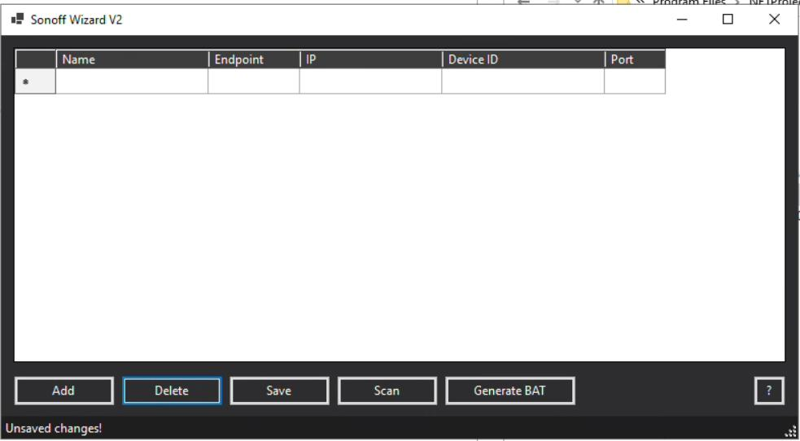

# Sonoff Wizard V2 🪄

A tiny WinForms utility that creates **PowerOn.bat / PowerOff.bat** files for
Sonoff DIY-mode relays and drops them straight into the Gizmo Server
`batch` folder.  
English UI, dark theme, single-file publish, auto-scan for devices – zero
manual installs for the end-user.

---

## Features

| ✔ | Details |
|---|---------|
| **Auto-scan** | mDNS (`_ewelink._tcp`) first, then fast port-scan (8081) – grabs *IP :8081* and clean **Device ID**. |
| **Manual editing** | Add / delete / edit rows directly in the table – Endpoint, Device ID, IP:Port. |
| **Dirty-tracking** | Status bar warns about unsaved changes & prompts on exit. |
| **Generate BAT** | Builds `PowerOn.bat` (switch ON) & `PowerOff.bat` (switch OFF) and drops them to `…\Gizmo Server\batch\`. |
| **Self-contained single EXE** | `dotnet publish` produces one portable file; runs even on machines without .NET installed. |
| **Help “?”** | Quick popup that explains every button. |
| **Dark theme** | ...because aesthetics matter 🙂 |

---

## Screenshots

| Main window | Scan complete |
|-------------|---------------|
|  |  |

*(replace with real shots if you wish)*

---

## Build & Run

### Prerequisites

* **.NET 8 SDK**  
  download: <https://dotnet.microsoft.com/download/dotnet/8.0>
* Visual Studio 2022+ **or** plain `dotnet` CLI.

### Clone

```bash
git clone https://github.com/<you>/SonoffWizardV2.git
cd SonoffWizardV2
